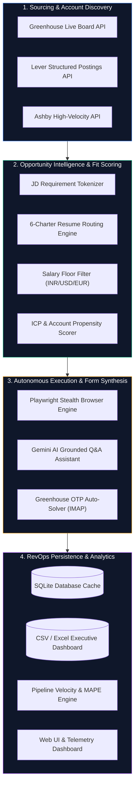

# ⚡ Nexus: Autonomous RevOps, GTM Strategy & Career Opportunity Intelligence Engine

<div align="center">

[](https://github.com/himanshugargnmims-cyber/job-hunter/stargazers)
[](https://github.com/himanshugargnmims-cyber/job-hunter/network/members)
[](https://github.com/himanshugargnmims-cyber/job-hunter/actions)
[](https://python.org)
[](https://playwright.dev/)
[](https://docker.com)
[](LICENSE)

**An Enterprise-Grade Revenue Operations (RevOps) Engine & Autonomous Opportunity Acquisition Platform.**  
*Applying the algorithmic precision, forecasting rigor, and pipeline velocity models of high-growth B2B SaaS to strategic career capital and enterprise job intelligence.*

[Explore Architecture](#-system-architecture) • [Quick Start](#-quick-start) • [RevOps Suite](#-revops--gtm-strategy-suite) • [Recruiter Walkthrough](#-for-hiring-managers--recruiters) • [Roadmap](#-community-roadmap--100k-stars-vision)

</div>

---

## 🎯 The Core Thesis: Career-as-a-Revenue-Engine

Most job searches are handled like chaotic outbound spam: high effort, low signal, and zero telemetry.

**Nexus** reframes high-stakes career advancement through the lens of an enterprise **Chief Revenue Officer (CRO)**:
- **The Candidate** is an **Enterprise Solution / High-Value Asset**.
- **Target Companies & JDs** are **Target Accounts & Ideal Customer Profiles (ICPs)**.
- **Resume Archetypes** are **Tailored Value Propositions** mapped to distinct buyer needs.
- **The Application Funnel** is treated with the exact mathematical discipline of **B2B Pipeline Velocity** ($V = \frac{N \times W \times S}{L}$).
- **Compensation & Career Goals** are guided by **AOP Quota Attainment & MAPE Forecasting Rigor**.

---

## 🏛️ System Architecture



---

## 💼 Why Hiring Managers & Recruiters Love This Project

When evaluating candidates for **Revenue Operations (RevOps)**, **Go-To-Market (GTM) Strategy**, **Chief of Staff**, or **Strategic Operations**, this repository serves as live proof of executive-level execution:

| RevOps Core Competency | How Nexus Proves It in Code |
| :--- | :--- |
| **Pipeline Forecasting & Variance Reduction** | [`revops_kit/forecasting_engine.py`](revops_kit/forecasting_engine.py) implements weighted probability modeling, AOP pacing, and Mean Absolute Percentage Error (**MAPE**) reduction (<12% error threshold). |
| **GTM Velocity & Conversion Sensitivity** | [`revops_kit/pipeline_velocity.py`](revops_kit/pipeline_velocity.py) models sales cycle compression, win-rate sensitivity, and compound ARR acceleration. |
| **Account Tiering & ICP Scoring** | [`revops_kit/lead_icp_scorer.py`](revops_kit/lead_icp_scorer.py) implements a 4-pillar scoring algorithm (firmographic, technographic, intent, and strategic fit) that directly powers the resume-to-JD matching engine. |
| **Board-Level Financial Telemetry** | [`revops_kit/executive_kpi_dashboard.py`](revops_kit/executive_kpi_dashboard.py) computes canonical SaaS metrics: **ARR, NRR, GRR, CAC Payback, SaaS Magic Number, and Rule of 40**. |
| **Complex Systems Automation** | [`scripts/hard_check_applier.py`](scripts/hard_check_applier.py) demonstrates enterprise-grade browser orchestration, automated email OTP parsing via IMAP, and bulletproof DOM state verification. |
| **AI Grounding & Knowledge Retrieval** | [`scripts/question_answerer.py`](scripts/question_answerer.py) uses **Google Gemini** with zero-hallucination candidate profile grounding to answer open-ended screening questions with quantified impact. |

---

## ⚡ Quick Start (Ready in 2 Minutes)

### 1. Clone & Install
```bash
git clone https://github.com/himanshugargnmims-cyber/job-hunter.git
cd job-hunter

python3 -m venv .venv
source .venv/bin/activate  # Windows: .venv\Scripts\activate

pip install -r requirements.txt
playwright install chromium
```

### 2. Onboard via Web UI (Drag & Drop)
```bash
python run.py --ui
```
> Open **`http://localhost:8080`** in your browser.  
> 1. Drag & drop your resume PDF.  
> 2. The parser auto-extracts contact details, experience, and links.  
> 3. Tweak target roles, location hubs, salary floors, and target companies.  
> 4. Hit **Save & Launch Pipeline**!

*(Alternatively, run the guided terminal wizard: `python run.py --setup`)*

---

## 📊 RevOps & GTM Strategy Suite

Run the full executive RevOps simulation directly from the CLI:

```bash
python run.py --revops
```

```text
======================================================================
    EXECUTIVE REVENUE FORECAST & AOP PACING REPORT
======================================================================
  Target Operating Quota (AOP) : $4,000,000.00
  Total Unweighted Pipeline    : $4,000,000.00 (1.0x Coverage)
  Stage-Weighted Probability   : $3,390,000.00
  Blended Executive Forecast   : $2,625,000.00 (65.6% Attainment)
  Historical Forecast Accuracy (MAPE) : 5.41% [Top-Decile Enterprise Rigor]
----------------------------------------------------------------------
  REVOPS LEVER OPTIMIZATION IMPACT (Sensitivity Model):
    1. Win Rate (+3% via Deal Desk)       : +$357,585.94 (+11.5%)
    2. Cycle Compression (-8 days via CPQ): +$442,725.45 (+14.3%)
    3. ACV Expansion (+10% via Packaging) : +$309,907.82 (+10.0%)
    --> COMPOUNDED REVOPS IMPACT          : +$1,246,442.42 (+40.2%)
======================================================================
```

Read the full [RevOps Playbook & Strategy Reference](docs/REVOPS_PLAYBOOK.md) for deep-dives into operating rhythms, deal desk structures, and SaaS metric formulas.

---

## 🛠️ CLI Command Reference

Nexus provides a unified CLI orchestrator:

```bash
# Interactive setup wizard
python run.py --setup

# Launch modern Web UI dashboard
python run.py --ui

# Run RevOps forecasting & pipeline velocity suite
python run.py --revops

# Ingest live postings matching target filters
python run.py --scrape

# Evaluate & score resume variants against scraped jobs (0-100%)
python run.py --match

# Auto-apply with Playwright (review simulation mode)
python run.py --apply --dry-run

# Run full end-to-end pipeline (Scrape -> Match -> Apply)
python run.py --all

# View database metrics & tracker summary
python run.py --stats

# Export multi-tab formatted Excel executive dashboard
python run.py --export
```

---

## 🐳 Docker Support

Run Nexus in a standalone container with zero local environment dependencies:

```bash
docker compose up -d
```
Access the Web UI immediately at `http://localhost:8080`.

---

## 🔒 Security, Privacy & Sanitization

This repository is strictly privacy-hardened:
- **No Personal Data Tracked**: All real resumes (`resumes/*.pdf`), session files (`sessions/*`), application databases (`data/*.db`), Excel workbooks (`*.xlsx`), and screenshot logs (`logs/*`) are **strictly gitignored**.
- **Zero Secrets**: Credentials and API keys are loaded strictly from `.env` (gitignored).
- **Template Architecture**: New users start cleanly with `.example` templates generated on the fly.

---

## 🌟 Community Roadmap & 100K Stars Vision

We are building the definitive open-source **Career Capital & Revenue Operations Operating System**:

- [x] Multi-ATS live ingestion (Greenhouse, Lever, Ashby)
- [x] 6-Charter Resume Routing Engine with objective fit scoring
- [x] Playwright form auto-filling with email OTP resolution
- [x] Google Gemini grounded AI screening Q&A
- [x] RevOps Intelligence Suite (Forecasting, Velocity, MAPE, ICP)
- [x] Zero-dependency Web UI Dashboard & Terminal Wizard
- [x] GitHub Actions automated daily scouting workflow
- [ ] **v2.0**: Integration with Salesforce & HubSpot CPQ APIs for live CRM sync
- [ ] **v2.1**: Automated LinkedIn Recruiter InMail response triage via LLM
- [ ] **v2.2**: Multi-agent collaborative interview prep simulator
- [ ] **v2.3**: One-click cloud deploy (Railway, Render, AWS ECS)

### How to Support
If you find this project valuable, **give it a star ⭐** and share it with founders, RevOps leaders, and operators!

---

## 📄 License

Distributed under the **MIT License**. See [`LICENSE`](LICENSE) for details.
