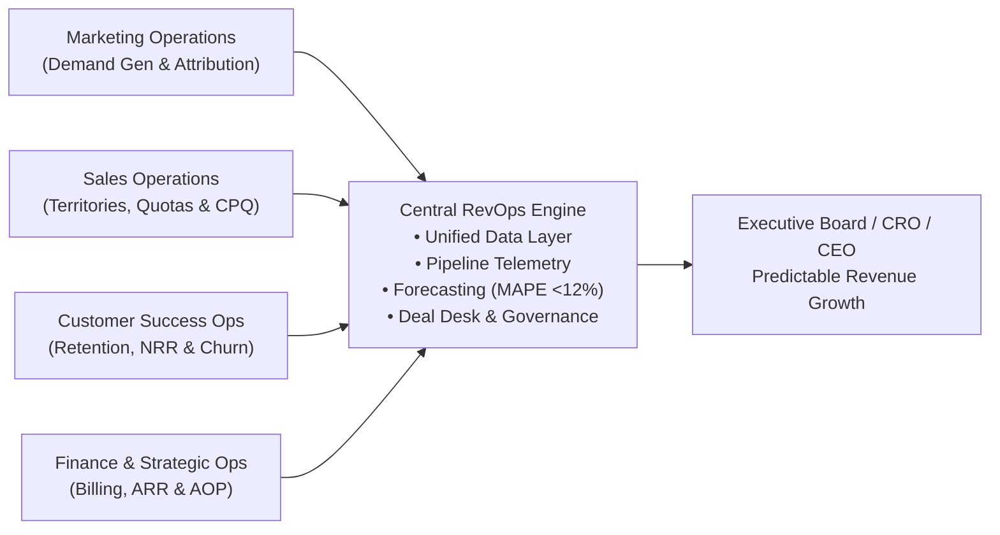

# 🌟 Awesome-RevOps: The Definitive B2B SaaS Revenue Operations Playbook

[](https://github.com/himanshugargnmims-cyber/job-hunter)
[](https://opensource.org/licenses/MIT)
[](CONTRIBUTING.md)

A curated collection of industry-standard B2B SaaS **Revenue Operations (RevOps)** frameworks, financial metrics, operational cadences, sales compensation calculators, tech stack architectures, and community resources.

---

## 📑 Table of Contents

- [The RevOps Operating Model](#-the-revops-operating-model)
- [Essential SaaS Metrics & Mathematical Cheat Sheet](#-essential-saas-metrics--mathematical-cheat-sheet)
- [Full-Funnel GTM Conversion Benchmarks](#-full-funnel-gtm-conversion-benchmarks)
- [Enterprise Deal Desk Governance Matrix](#-enterprise-deal-desk-governance-matrix)
- [Sales Compensation & Quota Capacity Architecture](#-sales-compensation--quota-capacity-architecture)
- [Executive Operating Cadences (WBR, MBR, QBR, AOP)](#-executive-operating-cadences)
- [GTM Tech Stack Taxonomy](#-gtm-tech-stack-taxonomy)
- [SQL & Python RevOps Code Snippets](#-sql--python-revops-code-snippets)
- [Top Communities, Podcasts & Newsletters](#-top-communities-podcasts--newsletters)

---

## 🏛 The RevOps Operating Model

Revenue Operations aligns **Marketing, Sales, Customer Success, and Finance** under a single data architecture, predictable forecasting engine, and continuous go-to-market feedback loop.



---

## 📊 Essential SaaS Metrics & Mathematical Cheat Sheet

| Metric | Formula | Top-Decile Benchmark | Strategic Meaning |
| :--- | :--- | :--- | :--- |
| **Pipeline Velocity ($V$)** | $V = \frac{N \times W \times S}{L}$ | Continuous MoM Growth | Daily/Quarterly ARR produced by the active commercial pipeline. |
| **Net Revenue Retention (NRR)** | $\frac{\text{Starting ARR} + \text{Expansion} - \text{Churn} - \text{Contraction}}{\text{Starting ARR}} \times 100$ | **>120%** (Enterprise) | Measures account health and expansion without new customer acquisition. |
| **Gross Retention Rate (GRR)** | $\frac{\text{Starting ARR} - \text{Churn} - \text{Contraction}}{\text{Starting ARR}} \times 100$ | **>90%** (SaaS) | Retention ceiling excluding upsells; pure product durability indicator. |
| **Bessemer Rule of 40** | $\text{ARR YoY Growth Rate (\%)} + \text{Free Cash Flow Margin (\%)} $ | **>40%** | Balances high growth against capital efficiency. |
| **SaaS Magic Number** | $\frac{(\text{Quarter } N \text{ ARR} - \text{Quarter } N-1 \text{ ARR}) \times 4}{\text{Quarter } N-1 \text{ Sales \& Marketing Spend}}$ | **>1.0x** | Efficiency of converting S&M dollars into net-new recurring revenue. |
| **CAC Payback Period** | $\frac{\text{Fully Loaded S\&M Spend}}{\text{Net New ARR Acquired} \times \text{Gross Margin \%}} \times 12$ | **<12 Months** | Months required to recover customer acquisition cash outlay. |
| **LTV : CAC Ratio** | $\frac{\text{Customer Lifetime Value}}{\text{Customer Acquisition Cost}}$ | **>3.5x** | Long-term return on acquisition marketing & sales investments. |
| **Forecast Error (MAPE)** | $\frac{1}{n} \sum \frac{\| \text{Actual} - \text{Forecast} \|}{\text{Actual}} \times 100$ | **<10-12%** | Forecasting precision and predictable quarterly predictability. |

---

## 🎯 Full-Funnel GTM Conversion Benchmarks

Standard stage progression yield for B2B Enterprise SaaS (OpenView & Winning By Design):

```
[ Top of Funnel: 10,000 Inbound/Outbound Leads ]
       │  (25-30% Conversion)
       ▼
[ Marketing Qualified Leads (MQL): 2,800 ]
       │  (50-60% Conversion)
       ▼
[ Sales Accepted Leads (SAL): 1,400 ]
       │  (40-50% Conversion)
       ▼
[ Sales Qualified Opportunities (SQL / Stage 1): 560 ]
       │  (50-55% Conversion)
       ▼
[ Technical Validation & POC: 280 ]
       │  (50% Conversion)
       ▼
[ Business Case & Pricing Proposal: 140 ]
       │  (30-40% Win Rate)
       ▼
[ Closed-Won Customers: ~48 ]
```

---

## ⚖️ Enterprise Deal Desk Governance Matrix

Establish structured commercial approval workflows to eliminate rogue discounting while maximizing contract velocity:

```
┌─────────────────┬───────────────────┬──────────────────────────────────────┐
│ Discount Level  │ Approval Level    │ Required Sign-Offs                   │
├─────────────────┼───────────────────┼──────────────────────────────────────┤
│ 0% - 10.0%      │ Level 0 (Auto)    │ Account Executive Discretion         │
│ 10.1% - 20.0%   │ Level 1 (Manager) │ Regional Sales Director / VP Sales   │
│ 20.1% - 30.0%   │ Level 2 (RevOps)  │ VP of Sales + Head of RevOps         │
│ > 30.0%         │ Level 3 (Exec)    │ Chief Revenue Officer (CRO) + CFO    │
└─────────────────┴───────────────────┴──────────────────────────────────────┘
```

### Commercial Deal Sweeteners vs Traps:
- **Cash Flow Levers**: Offer an extra 3-5% discount exclusively in exchange for **Multi-Year Upfront Pre-Payment** (Net 30).
- **Opt-Out Clauses**: Never accept unilateral "termination for convenience" without a 60-day notice and clawback of discounted pricing.
- **Payment Terms**: Standard is Net 30. Net 60/90 requires VP approval due to working capital drag.

---

## 💰 Sales Compensation & Quota Capacity Architecture

### 1. Quota-to-OTE Multipliers
- **Enterprise Account Executive (AE)**: **4.5x to 6.0x** (e.g. $250k OTE = $1.25M - $1.5M Quota).
- **Commercial / Mid-Market AE**: **4.0x to 5.0x**.
- **SDR / BDR**: **1.8x to 2.5x** pipeline generated quota.

### 2. Standard SaaS Pay Curves & Accelerators
- **0% - 80% Attainment**: Base commission rate paid per dollar closed.
- **80% - 100% Attainment**: 1.0x standard commission multiplier.
- **100% - 125% Attainment**: **1.5x Accelerated Rate** (President's Club tier).
- **>125% Attainment**: **2.0x Super-Accelerator Rate** (rewards outlier top-performers).

---

## 📅 Executive Operating Cadences

1. **Weekly Business Review (WBR)**:
   - Focus: Stage progression, commit deal health, slip deal analysis, weekly pacing against monthly linear targets.
2. **Monthly GTM Operations**:
   - Focus: Pipeline creation by source (Inbound vs Outbound vs Partner), SDR conversion rates, marketing campaign attribution.
3. **Quarterly Business Review (QBR)**:
   - Focus: Win/loss analysis, competitor displacement trends, sales cycle duration by segment, rep attainment distribution.
4. **Annual Operating Plan (AOP)**:
   - Focus: Headcount capacity modeling, ramp time adjustments, territory rebalancing, quota setting, TAM/SAM/SOM recalculation.

---

## 🛠 GTM Tech Stack Taxonomy

| Function | Best-in-Class Tools |
| :--- | :--- |
| **Core CRM** | Salesforce (SFDC), HubSpot CRM |
| **CPQ & Billing** | Salesforce CPQ, DealHub, Cacheflow, Stripe Billing, Chargebee |
| **Conversation Intelligence** | Gong.io, Chorus by ZoomInfo |
| **Lead & Account Enrichment** | Clearbit, ZoomInfo, Apollo.io, Clay |
| **Data Warehouse & Modeling** | Snowflake, BigQuery, dbt, Fivetran |
| **Commission & Incentive Compensation** | CaptivateIQ, Spiff (Salesforce), QuotaPath |
| **Customer Success & Retention** | Gainsight, ChurnZero, Vitally |

---

## 💻 SQL & Python RevOps Code Snippets

### 1. Calculate Pipeline Velocity in Python
```python
from revops_kit.pipeline_velocity import PipelineVelocityCalculator

calc = PipelineVelocityCalculator(
    num_opportunities=85,
    win_rate_pct=28.5,
    avg_deal_size=75000.0,
    sales_cycle_days=62
)
metrics = calc.calculate_velocity()
print(f"Quarterly Revenue Velocity: ${metrics['quarterly_revenue_velocity']:,.2f}")
```

### 2. Forecast Error Variance (MAPE)
```python
from revops_kit.forecasting_engine import RevenueForecaster

actuals = [3200000, 3600000, 3400000, 3900000]
forecasts = [3450000, 3800000, 3550000, 4050000]
mape = RevenueForecaster.calculate_mape(actuals, forecasts)
print(f"Historical Forecast MAPE: {mape:.2f}% (Target: <12%)")
```

---

## 🌐 Top Communities, Podcasts & Newsletters

- **[RevOps Co-op](https://www.revopscoop.com/)**: Global community of 10,000+ RevOps practitioners with active Slack.
- **[Modern Sales Pros (MSP)](https://modernsaleshq.com/)**: Premier peer-learning community for revenue leadership.
- **[Pavilion](https://www.joinpavilion.com/)**: Private executive network for CROs, CMOs, and VPs of RevOps.
- **[The Revenue Engine Podcast](https://therevenueenginepodcast.com/)**: Interviews with high-growth SaaS operators.
- **[SaaS Capital Research](https://www.saas-capital.com/)**: Empirical private SaaS benchmarking and valuation multiples.

---

*Curated with ❤️ by the Nexus RevOps & GTM Engineering Team. Contributions welcome!*
